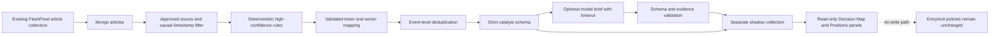

# Data Flow

```mermaid
flowchart LR
  A[Existing FlashFeed article collectors] --> B[Mongo articles]
  B --> C[Approved source and causal timestamp filter]
  C --> D[Deterministic high-confidence rules]
  D --> E[Validated ticker and sector mapping]
  E --> F[Event-level deduplication]
  F --> G[Strict catalyst schema]
  G --> H[Optional model brief with timeout]
  H --> I[Schema and evidence validation]
  I --> J[Separate shadow collection]
  G --> J
  J --> K[Read-only Decision Map and Positions panels]
  K -. no write path .-> L[Entry/exit policies remain unchanged]
```
